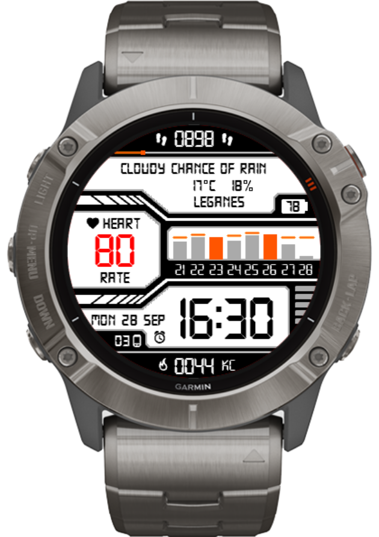

# AlejacmaW1

My first watch face for Garmin Fenix 6X, inspired by [CASIO III](https://apps.garmin.com/es-ES/apps/0adf6c94-07b8-4071-8292-38875918c85e), which is not supported on this model yet (27th Sept, 2020).

Note this is a work in progress.

## TO DO
- Code refactor.
- Full Spanish support.
- Configure colors via settings.
- Tweak design.

# Useful links

Official documentation:
- [Garmin Connect IQ for developers](https://developer.garmin.com/connect-iq/overview/)
- [Monkey C Language Reference](https://developer.garmin.com/connect-iq/reference-guides/monkey-c-reference/)
- [Toybox API docs](https://developer.garmin.com/connect-iq/api-docs/index.html)
- [Device reference](https://developer.garmin.com/connect-iq/reference-guides/devices-reference/)
    - [fenix® 6X Pro / 6X Sapphire / 6X Pro Solar / tactix® Delta Sapphire / Delta Solar / Delta Solar - Ballistics Edition / quatix® 6X / 6X Solar / 6X Dual Power](https://developer.garmin.com/connect-iq/reference-guides/devices-reference/#f%C4%93nix%C2%AE6xpro6xsapphire6xprosolartactix%C2%AEdeltasapphiredeltasolardeltasolar-ballisticseditionquatix%C2%AE6x6xsolar6xdualpower)

Fonts:
- [Technology 2](https://www.dafont.com/es/technology-2.font?text=14%3A26)

Other watch faces with source code:
- [Connect-IQ-WatchFace](https://gitlab.com/ravenfeld/Connect-IQ-WatchFace)
- [Connect IQ Apps with Source Code](https://starttorun.info/connect-iq-apps-with-source-code/)